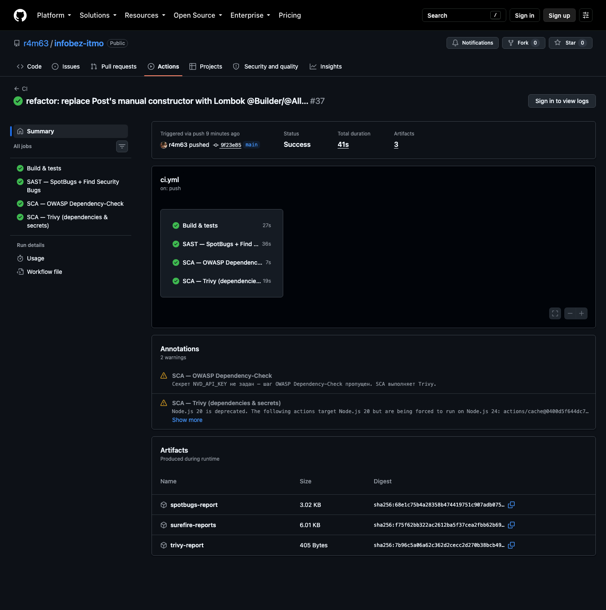
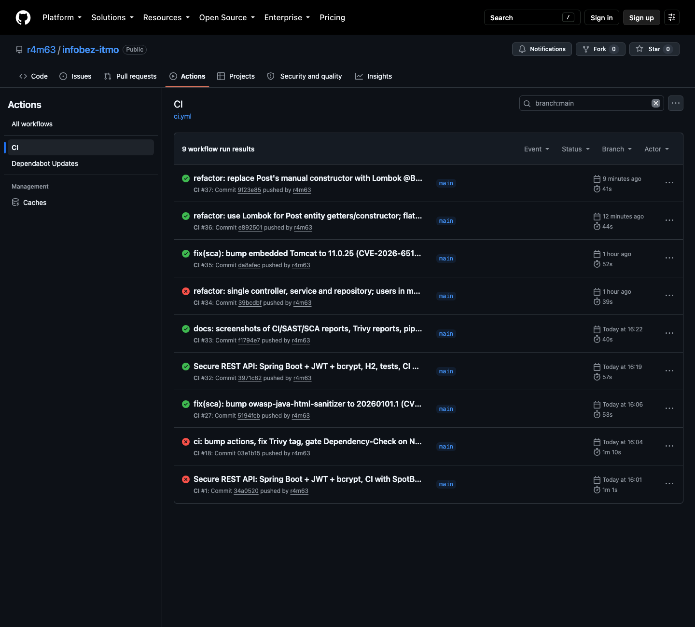
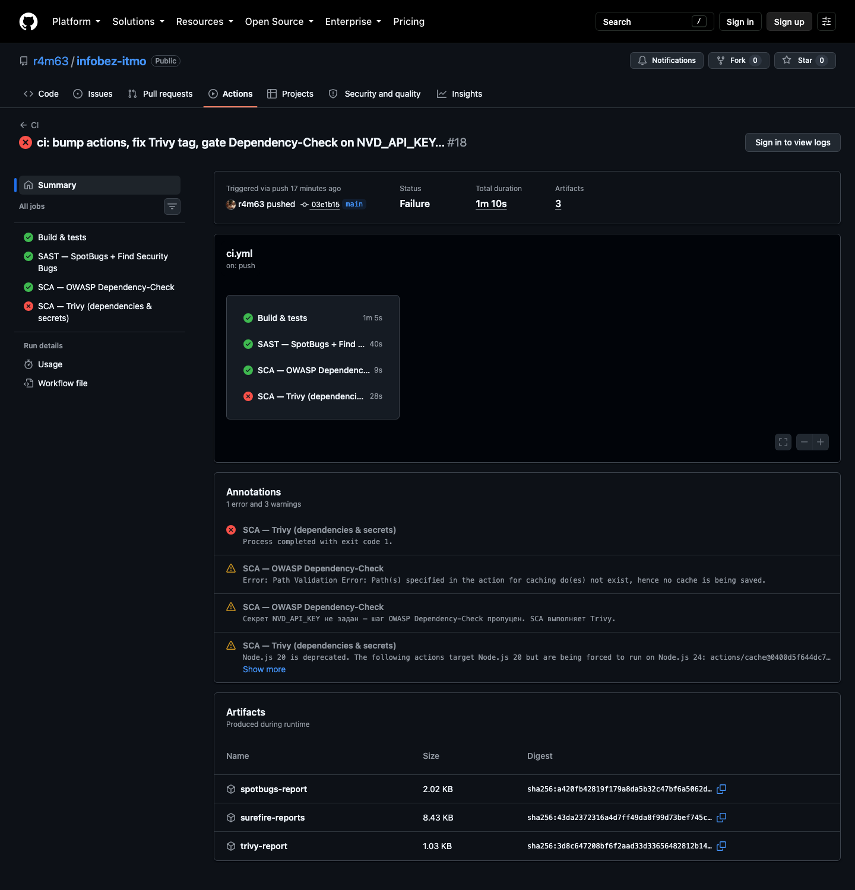
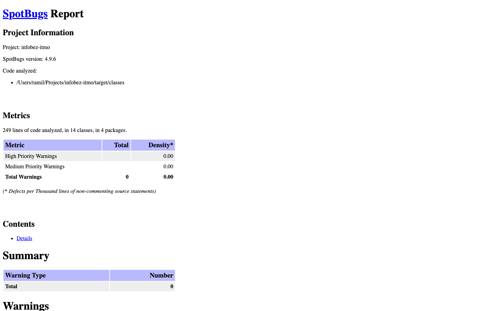

# Работа 1: защищённый REST API с интеграцией в CI/CD

Учебный backend на **Java 25 / Spring Boot 4.1 / Maven** с тремя эндпоинтами, JWT-аутентификацией,
bcrypt-хешированием паролей, защитой от SQL-инъекций и XSS, и GitHub Actions pipeline с SAST/SCA-сканерами.

- Репозиторий: <https://github.com/r4m63/infobez-itmo>
- Pipeline: <https://github.com/r4m63/infobez-itmo/actions/workflows/ci.yml>
- Последний успешный запуск pipeline: <https://github.com/r4m63/infobez-itmo/actions/runs/35107799931>
- Все успешные запуски на
  `main`: <https://github.com/r4m63/infobez-itmo/actions/workflows/ci.yml?query=branch%3Amain+is%3Asuccess>

## Стек

| Компонент        | Выбор                                                                                                                    |
|------------------|--------------------------------------------------------------------------------------------------------------------------|
| Язык / фреймворк | Java 25, Spring Boot 4.1.1 (Web, Security, Data JPA, Validation)                                                         |
| Сборка           | Maven (`./mvnw`)                                                                                                         |
| БД               | Посты — H2 in-memory через JPA/Hibernate; пользователи — массив в памяти (`InMemoryUserDetailsManager`). Docker не нужен |
| JWT              | Nimbus JOSE+JWT (`JwtEncoder`/`JwtDecoder` из Spring Security), HS256                                                    |
| Пароли           | bcrypt, cost 12 (`BCryptPasswordEncoder`)                                                                                |
| SAST             | SpotBugs + Find Security Bugs                                                                                            |
| SCA              | OWASP Dependency-Check, Trivy, Dependabot                                                                                |

## Запуск

```bash
cp .env.example .env            # задать JWT_SECRET (>= 32 символов) и пароли демо-пользователей
set -a && source .env && set +a
./mvnw spring-boot:run
```

При старте создаются пользователи `admin` и `user` с паролями из `DEMO_ADMIN_PASSWORD` / `DEMO_USER_PASSWORD`
(хранятся только bcrypt-хеши). Тесты: `./mvnw verify`.

Код намеренно простой: **один контроллер
** ([ApiController](src/main/java/com/itmo/infobezitmo/controller/ApiController.java)),
**один сервис** ([ApiService](src/main/java/com/itmo/infobezitmo/service/ApiService.java)) и
**один репозиторий** ([PostRepository](src/main/java/com/itmo/infobezitmo/repository/PostRepository.java)).

## API

| Метод  | Путь          | Доступ    | Описание                                                   |
|--------|---------------|-----------|------------------------------------------------------------|
| `POST` | `/auth/login` | публичный | Принимает `{"username","password"}`, возвращает JWT        |
| `GET`  | `/api/data`   | JWT       | Список постов, необязательный поиск `?query=` по заголовку |
| `POST` | `/api/posts`  | JWT       | Создание поста; автор берётся из токена                    |

### Примеры (curl)

```bash
# 1. Логин -> JWT
TOKEN=$(curl -s -X POST localhost:8080/auth/login \
  -H 'Content-Type: application/json' \
  -d '{"username":"admin","password":"<DEMO_ADMIN_PASSWORD>"}' | jq -r .accessToken)

# 2. Данные (только с токеном)
curl localhost:8080/api/data -H "Authorization: Bearer $TOKEN"
curl "localhost:8080/api/data?query=первый" -H "Authorization: Bearer $TOKEN"

# 3. Создание поста
curl -X POST localhost:8080/api/posts \
  -H "Authorization: Bearer $TOKEN" -H 'Content-Type: application/json' \
  -d '{"title":"Заголовок","content":"Текст"}'
```

Ответы:

```json
// POST /auth/login -> 200
{
  "accessToken": "eyJhbGciOiJIUzI1NiJ9...",
  "tokenType": "Bearer",
  "expiresIn": 900
}
// GET /api/data без токена -> 401
// POST /auth/login с неверным паролем -> 401
{
  "detail": "Invalid username or password",
  "instance": "/auth/login",
  "status": 401,
  "title": "Unauthorized"
}
```

Полный протокол проверки через curl (без токена, неверный пароль, логин, данные, XSS- и SQLi-нагрузки,
поддельный токен): [docs/curl-session.txt](docs/curl-session.txt).

## Реализованные меры защиты

### 1. SQL-инъекции (OWASP A03:2021 Injection)

Ни одного SQL-запроса, собранного конкатенацией строк, в проекте нет. Весь доступ к БД идёт через
Spring Data JPA / Hibernate:

- `PostRepository.findAllByOrderByCreatedAtDesc()` — запрос генерируется Spring Data по имени метода.
- `PostRepository.searchByTitle(...)` — JPQL с именованным параметром `:query`
  ([PostRepository.java](src/main/java/com/itmo/infobezitmo/repository/PostRepository.java)). Hibernate передаёт
  значение отдельно от текста запроса, поэтому нагрузка `' OR '1'='1` ищется как обычная строка и
  возвращает пустой список (см. тест `sqlInjectionInSearchIsHarmless`).
- Сортировка задана в коде, имя поля от пользователя не принимается; длина `query` ограничена
  `@Size(max = 100)`.

### 2. XSS (OWASP A03:2021 Injection)

Все пользовательские строки, возвращаемые API, экранируются встроенной функцией фреймворка
`HtmlUtils.htmlEscape` при формировании DTO ответа
(`ApiService.PostDto.from` в [ApiService.java](src/main/java/com/itmo/infobezitmo/service/ApiService.java)):
`<script>alert(1)</script>` возвращается как `&lt;script&gt;alert(1)&lt;/script&gt;`
(тест `htmlInResponseIsEscaped`). Дополнительно:

- ответы отдаются только как `application/json`;
- заголовки `Content-Security-Policy: default-src 'none'; frame-ancestors 'none'` и
  `X-Content-Type-Options: nosniff`;
- длина полей ограничена Bean Validation (`@Size`), пустые значения отклоняются (`@NotBlank`).

### 3. Broken Authentication (OWASP A07:2021)

**Выдача JWT.** `POST /auth/login` → `ApiService.login` передаёт логин/пароль в `AuthenticationManager`
(пароль сверяется с bcrypt-хешем); при успехе
[JwtService](src/main/java/com/itmo/infobezitmo/security/JwtService.java) выпускает токен HS256 с claims
`iss`, `sub` (логин), `iat`, `exp` (TTL 15 минут), `roles`. Секрет подписи берётся только из переменной
окружения `JWT_SECRET` и проверяется на длину >= 32 символов; значения по умолчанию нет.

**Middleware проверки токена.**
[JwtAuthenticationFilter](src/main/java/com/itmo/infobezitmo/security/JwtAuthenticationFilter.java) —
`OncePerRequestFilter`, включённый в цепочку Spring Security перед стандартным фильтром логина. На каждом
запросе он читает `Authorization: Bearer <token>`, проверяет подпись, срок действия и издателя
(`JwtValidators.createDefaultWithIssuer`) и помещает пользователя в `SecurityContext`. В
[SecurityConfig](src/main/java/com/itmo/infobezitmo/config/SecurityConfig.java) правило
`anyRequest().authenticated()` закрывает всё, кроме `/auth/login`: без токена или с поддельным токеном
ответ `401` (тесты `dataWithoutTokenIsForbidden`, `forgedTokenIsRejected`).

**Хранение паролей.** Только bcrypt-хеши (cost 12): `PasswordEncoder` и `userDetailsService` в
[SecurityConfig](src/main/java/com/itmo/infobezitmo/config/SecurityConfig.java) хешируют пароли из
переменных окружения при старте, открытые значения нигде не сохраняются и не логируются
(`LoginRequest.toString()` маскирует поле). Пример хеша: `$2a$12$SlVwdSfys0o.ut4PfOJine...`.

**Дополнительно.** Одинаковый ответ для неизвестного логина и неверного пароля
(`hideUserNotFoundExceptions`), stateless-сессии, ошибки отдаются в формате ProblemDetail без стектрейсов,
логины в логах очищаются от `\r\n` (log forging).

## CI/CD pipeline

Файл: [.github/workflows/ci.yml](.github/workflows/ci.yml). Запускается при каждом `push`, `pull_request`
и вручную. Четыре независимых job:

| Job                    | Тип  | Инструмент                    | Что делает                                                                                                                                                                                     |
|------------------------|------|-------------------------------|------------------------------------------------------------------------------------------------------------------------------------------------------------------------------------------------|
| Build & tests          | —    | Maven, JUnit                  | `./mvnw verify`: сборка и 10 интеграционных тестов безопасности                                                                                                                                |
| SAST                   | SAST | SpotBugs + Find Security Bugs | Статический анализ байткода (effort Max, threshold Medium); job падает при любой находке. Отчёт `spotbugs.html` в артефактах                                                                   |
| SCA — Dependency-Check | SCA  | OWASP Dependency-Check        | Поиск CVE в зависимостях, `failBuildOnCVSS=7`; HTML/JSON-отчёт в артефактах. Требует секрет `NVD_API_KEY` (без него NVD API с GitHub-раннеров не отвечает, шаг пропускается с предупреждением) |
| SCA — Trivy            | SCA  | Trivy                         | Сканирует `pom.xml` на HIGH/CRITICAL CVE, а также секреты и мисконфигурации; отчёт в артефактах и в Job Summary                                                                                |

Дополнительно включён Dependabot ([.github/dependabot.yml](.github/dependabot.yml)) — еженедельные PR с
обновлениями зависимостей Maven и GitHub Actions.

### Найденная и исправленная уязвимость

При первом запуске Trivy обнаружил в проекте **CVE-2025-66021 (HIGH)** — XSS в библиотеке
`owasp-java-html-sanitizer 20240325.1`, которая использовалась в ранней версии проекта. Уязвимая
зависимость была удалена (экранирование выполняется штатным `HtmlUtils.htmlEscape`), после чего SCA
проходит без замечаний.

Фрагмент отчёта Trivy до исправления (артефакт `trivy-report` запуска
[#18](https://github.com/r4m63/infobez-itmo/actions/runs/35099573443)):

```
pom.xml (pom)
=============
Total: 1 (HIGH: 1, CRITICAL: 0)

┌──────────────────────────────────────────────────────────────┬────────────────┬──────────┬────────┬───────────────────┬───────────────┬──────────────────────────────────────────────────────────────┐
│                           Library                            │ Vulnerability  │ Severity │ Status │ Installed Version │ Fixed Version │                            Title                             │
├──────────────────────────────────────────────────────────────┼────────────────┼──────────┼────────┼───────────────────┼───────────────┼──────────────────────────────────────────────────────────────┤
│ com.googlecode.owasp-java-html-sanitizer:owasp-java-html-sa- │ CVE-2025-66021 │ HIGH     │ fixed  │ 20240325.1        │ 20260101.1    │ com.googlecode.owasp-java-html-sanitizer/owasp-java-html-sa- │
│ nitizer                                                      │                │          │        │                   │               │ nitizer: OWASP Java HTML Sanitizer vulnerable to XSS         │
│                                                              │                │          │        │                   │               │ https://avd.aquasec.com/nvd/cve-2025-66021                   │
└──────────────────────────────────────────────────────────────┴────────────────┴──────────┴────────┴───────────────────┴───────────────┴──────────────────────────────────────────────────────────────┘
```

Отчёт Trivy в текущем успешном запуске
([#37](https://github.com/r4m63/infobez-itmo/actions/runs/35107799931)):

```
Report Summary

┌───────────────────────┬──────┬─────────────────┬─────────┬───────────────────┐
│        Target         │ Type │ Vulnerabilities │ Secrets │ Misconfigurations │
├───────────────────────┼──────┼─────────────────┼─────────┼───────────────────┤
│ pom.xml               │ pom  │        0        │    -    │         -         │
├───────────────────────┼──────┼─────────────────┼─────────┼───────────────────┤
│ docs/curl-session.txt │ text │        -        │    0    │         -         │
└───────────────────────┴──────┴─────────────────┴─────────┴───────────────────┘
Legend:
- '-': Not scanned
- '0': Clean (no security findings detected)
```

### Скриншоты отчётов

Успешный запуск pipeline (все четыре job зелёные):



Список запусков workflow CI:



Trivy: найдена уязвимость CVE-2025-66021 в зависимости (запуск до исправления):



Отчёт SpotBugs + Find Security Bugs (0 замечаний):



## Структура проекта

```
src/main/java/com/itmo/infobezitmo/
├── controller/ApiController.java        один контроллер: POST /auth/login, GET /api/data, POST /api/posts
├── controller/ApiExceptionHandler.java  единый формат ошибок без стектрейсов
├── service/ApiService.java              один сервис: логин (bcrypt + JWT), выборка, создание; DTO с экранированием
├── repository/PostRepository.java       один репозиторий: параметризованные запросы (защита от SQLi)
├── model/Post.java                      сущность H2
├── security/JwtService.java             выпуск и проверка JWT (HS256)
├── security/JwtAuthenticationFilter.java middleware: проверяет Bearer-токен на каждом запросе
└── config/SecurityConfig.java           правила доступа, bcrypt, пользователи в памяти
src/test/java/.../ApiSecurityTest.java   10 тестов: логин, 401 без токена, поддельный токен, XSS, SQLi, валидация
.github/workflows/ci.yml                 pipeline: тесты, SpotBugs, Dependency-Check, Trivy
```

## Контрольные вопросы

**1. Почему bcrypt предпочтительнее SHA-256 для паролей?**
SHA-256 — быстрый хеш общего назначения: на GPU считаются миллиарды хешей в секунду, поэтому утёкшую
базу перебирают по словарю за часы, а без соли одинаковые пароли дают одинаковые хеши и ломаются
радужными таблицами. bcrypt создан именно для паролей: он медленный по конструкции, стоимость
регулируется параметром cost (у нас 12 ≈ 250 мс на хеш) и растёт вместе с мощностью железа,
соль генерируется автоматически и хранится внутри строки хеша. В итоге перебор одного пароля стоит
в миллионы раз дороже, а радужные таблицы бесполезны.

**2. Разница между SAST и DAST.**
SAST (Static Application Security Testing) анализирует исходный код или байткод без запуска
приложения: находит опасные конструкции (конкатенация SQL, слабая криптография, отключённый CSRF),
работает рано, на каждом коммите, знает точную строку кода, но даёт ложные срабатывания и не видит
проблем конфигурации и окружения. DAST (Dynamic AST) тестирует уже запущенное приложение снаружи как
злоумышленник (OWASP ZAP, Burp): отправляет запросы с нагрузками и смотрит на ответы. Он не зависит
от языка и находит реальные эксплуатируемые проблемы, но не указывает на строку кода, работает
позже и медленнее. В этой работе используется SAST (SpotBugs/FindSecBugs); SCA-сканеры дополняют его
проверкой зависимостей.

**3. Механизм работы JWT.**
JWT — три части в Base64URL, разделённые точками: `header.payload.signature`. Header содержит
алгоритм (`HS256`) и тип; payload — claims: `iss` (издатель), `sub` (пользователь), `iat`/`exp`
(время выпуска и истечения), пользовательские поля (`roles`). Подпись = HMAC-SHA256 от
`base64(header).base64(payload)` на секретном ключе сервера. При запросе клиент шлёт токен в
`Authorization: Bearer`. Сервер заново вычисляет подпись по своему секрету и сравнивает с
присланной: если payload изменён или подписан другим ключом, подпись не совпадёт и токен
отвергается. Затем проверяются `exp` и `iss`. Payload только закодирован, не зашифрован, поэтому
секретов в нём быть не должно. Сервер не хранит сессий — вся информация в самом токене.

**4. Риски без аудита зависимостей.**
Современное приложение на 80–90 % состоит из чужого кода. Без SCA-аудита в проект попадают
библиотеки с известными CVE (Log4Shell в log4j, RCE в Spring4Shell, XSS в html-sanitizer из этой
работы) — злоумышленнику достаточно проверить версию. Уязвимость может быть транзитивной, то есть в
зависимости зависимости, которую разработчик даже не видит. Добавляются риски supply chain:
захваченные пакеты, typosquatting, вредоносный код в обновлениях, а также лицензионные нарушения и
заброшенные библиотеки, которые никто не исправит. Автоматический аудит (Dependency-Check, Trivy,
Dependabot) на каждом push позволяет узнать об уязвимости и обновиться до того, как её используют.
