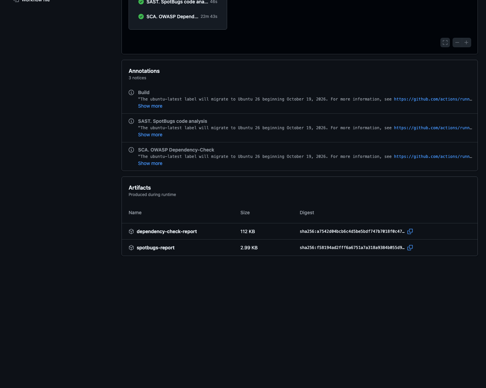
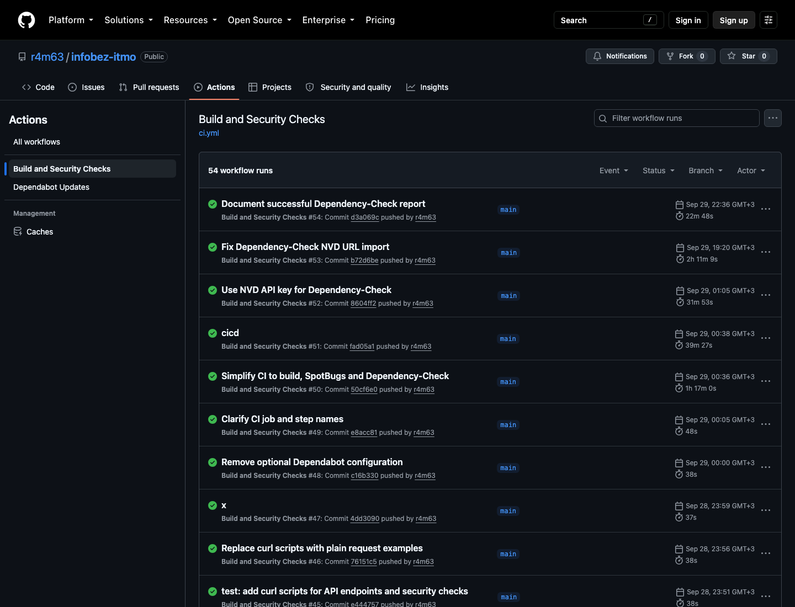
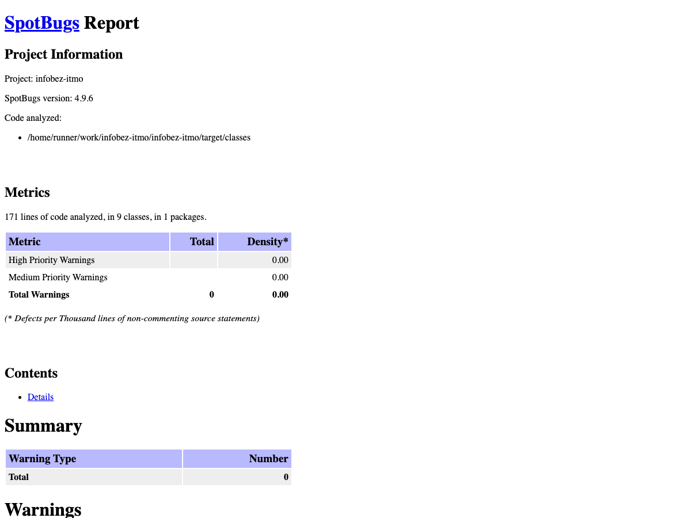
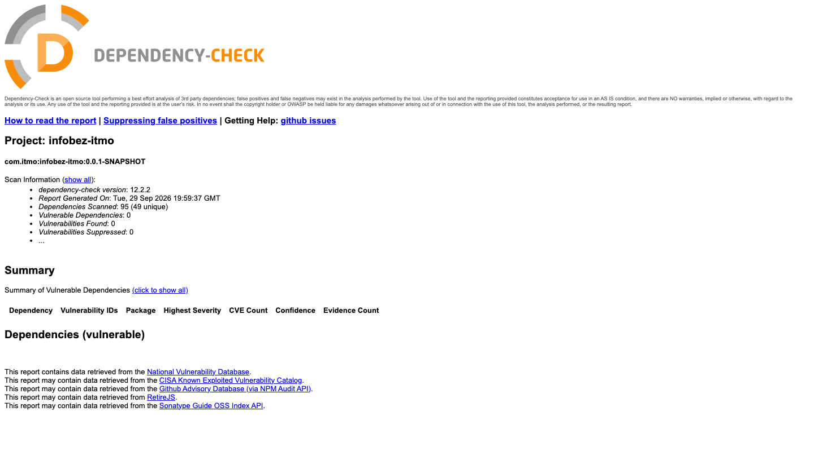

# Разработка защищенного REST API с интеграцией в CI/CD

Учебный backend на **Java 25 + Spring Boot 4.1.1** с аутентификацией по JWT,
хэшированием паролей bcrypt, защитой от SQL-инъекций и XSS. При каждом `push`
и `pull_request` GitHub Actions собирает проект и запускает SAST (SpotBugs +
Find Security Bugs) и SCA (OWASP Dependency-Check).

- Репозиторий: <https://github.com/r4m63/infobez-itmo>
- Workflow: [Build and Security Checks](https://github.com/r4m63/infobez-itmo/actions/workflows/ci.yml)
- Последний успешный запуск pipeline: <https://github.com/r4m63/infobez-itmo/actions/runs/36620490824/job/109584335296>

## Содержание

1. [Стек и структура](#стек-и-структура)
2. [Запуск](#запуск)
3. [API](#api)
4. [Меры защиты](#меры-защиты)
5. [CI/CD и security-сканеры](#cicd-и-security-сканеры)
6. [Отчёты SAST/SCA](#отчёты-sastsca)
7. [Тестирование](#тестирование)
8. [Контрольные вопросы](#контрольные-вопросы)

## Стек и структура

| Компонент           | Технология                                                                      |
|---------------------|---------------------------------------------------------------------------------|
| Язык / сборка       | Java 25, Maven (wrapper `./mvnw`)                                               |
| Фреймворк           | Spring Boot 4.1.1 (Web, Security, OAuth2 Resource Server, Data JPA, Validation) |
| База данных         | H2 в памяти, доступ через Hibernate (JPA)                                       |
| Токены              | JWT HS256 (Nimbus JOSE, входит в Spring Security)                               |
| Хэширование паролей | bcrypt, cost 12                                                                 |
| SAST                | SpotBugs 4.9.6 + Find Security Bugs 1.14.0                                      |
| SCA                 | OWASP Dependency-Check 12.2.2                                                   |

## Запуск

```bash
./mvnw spring-boot:run
```

Приложение слушает `http://localhost:8080`. Данные H2 живут в памяти и сбрасываются при перезапуске; при старте
создаются два поста.

Учебные пользователи: `admin` / `admin-password` и `user` / `user-password`.
В `application.yaml` хранятся только их bcrypt-хэши, открытых паролей в коде нет.

Локальный запуск проверок:

```bash
./mvnw -DskipTests compile spotbugs:spotbugs spotbugs:check
./mvnw -DskipTests dependency-check:check
```

## API

| Метод | Путь          | Доступ     | Назначение                                 |
|-------|---------------|------------|--------------------------------------------|
| POST  | `/auth/login` | публичный  | Проверяет логин и пароль, возвращает JWT   |
| GET   | `/api/data`   | Bearer JWT | Список постов; `?query=` ищет по заголовку |
| POST  | `/api/posts`  | Bearer JWT | Создаёт пост; автор берётся из токена      |

### POST /auth/login

```bash
curl -X POST localhost:8080/auth/login \
  -H 'Content-Type: application/json' \
  -d '{"username":"admin","password":"admin-password"}'
```

```json
{
  "accessToken": "eyJhbGciOiJIUzI1NiJ9...",
  "tokenType": "Bearer",
  "expiresIn": 900
}
```

Неверный логин или пароль: `401 {"detail":"Invalid username or password", ...}`.
Пустые поля или слишком длинные значения: `400 Validation failed`.

### GET /api/data

```bash
curl localhost:8080/api/data -H "Authorization: Bearer $TOKEN"
curl -G localhost:8080/api/data --data-urlencode 'query=пост' -H "Authorization: Bearer $TOKEN"
```

```json
{
  "items": [
    {
      "id": 2,
      "title": "Второй пост",
      "content": "...",
      "author": "user",
      "createdAt": "2026-09-30T17:07:34Z"
    }
  ],
  "total": 2
}
```

Без токена или с недействительным токеном: `401`.

### POST /api/posts

```bash
curl -X POST localhost:8080/api/posts \
  -H "Authorization: Bearer $TOKEN" -H 'Content-Type: application/json' \
  -d '{"title":"Заголовок","content":"Текст"}'
```

Ответ `201 Created` с созданным постом. Поле `author` заполняется из `sub`
проверенного токена, подставить чужое имя через JSON нельзя.

### Postman

Импортируйте [openapi.yaml](openapi.yaml) через **Import → File**, вызовите
`POST /auth/login`, скопируйте `accessToken` и для остальных запросов выберите
**Authorization → Bearer Token**. Готовые команды: [test/requests.txt](test/requests.txt).

## Меры защиты

### SQL-инъекции (OWASP A03:2021 Injection)

- SQL вручную не собирается: все обращения к БД идут через Spring Data JPA / Hibernate.
- Поиск использует JPQL с именованным параметром
  ([PostRepository.java](src/main/java/com/itmo/infobezitmo/PostRepository.java)):

  ```java
  @Query("SELECT p FROM Post p WHERE LOWER(p.title) LIKE LOWER(CONCAT('%', :query, '%')) ORDER BY p.createdAt DESC")
  List<Post> searchByTitle(@Param("query") String query);
  ```

  Hibernate превращает `:query` в placeholder `?` prepared statement, значение
  передаётся драйверу отдельно от текста запроса. Нагрузка `' OR '1'='1`
  ищется как обычная строка и возвращает пустой список.
- Длина `query` ограничена 100 символами (`@Size`).

### XSS (межсайтовый скриптинг)

- Все текстовые поля поста (`title`, `content`, `author`) перед отправкой
  клиенту проходят через `HtmlUtils.htmlEscape` (метод `escape` в
  [ApiController.java](src/main/java/com/itmo/infobezitmo/ApiController.java)).
  `<script>alert(1)</script>` возвращается как `&lt;script&gt;alert(1)&lt;/script&gt;`.
- Ответы отдаются как `application/json` с заголовками
  `X-Content-Type-Options: nosniff` и
  `Content-Security-Policy: default-src 'none'; frame-ancestors 'none'`,
  поэтому браузер не выполнит ответ API как HTML или скрипт.

### Аутентификация (OWASP A07:2021, A01:2021)

- **Хранение паролей.** Только bcrypt-хэши с солью и cost 12
  (`BCryptPasswordEncoder(12)`). Открытые пароли нигде не хранятся.
- **Выдача JWT.** После успешной проверки пароля `/auth/login` выпускает токен
  HS256 с claims `iss`, `sub`, `iat`, `exp`. Срок жизни 15 минут
  (`app.jwt.ttl`). Ключ подписи 256 бит генерируется `SecureRandom` при старте
  приложения и не лежит в репозитории.
- **Middleware проверки токена.** В
  [SecurityConfig.java](src/main/java/com/itmo/infobezitmo/SecurityConfig.java)
  подключён `BearerTokenAuthenticationFilter` (OAuth2 Resource Server) с
  `NimbusJwtDecoder`: он проверяет подпись, алгоритм HS256, `exp`/`nbf` и
  издателя `iss`. Любая ошибка даёт `401`.
- **Контроль доступа.** Открыт только `/auth/login`, все остальные пути
  требуют аутентификации (`anyRequest().authenticated()`).
- **Защита от перебора логинов.** Для несуществующего пользователя bcrypt всё
  равно выполняется, ответ одинаковый (`Invalid username or password`), поэтому
  по времени и тексту ответа нельзя понять, существует ли логин.
- **Stateless.** Сессий и cookie нет (`SessionCreationPolicy.STATELESS`), CSRF
  для такого API не применим и отключён.

### Прочее

- Bean Validation на всех входных DTO (`@NotBlank`, `@Size`), ошибки возвращаются
  как `ProblemDetail` без стектрейсов.
- `LoginRequest.toString()` маскирует пароль, чтобы он не попал в логи.

Для реального развёртывания дополнительно нужны HTTPS, ограничение частоты
попыток входа, хранение ключа JWT в секрет-хранилище и отзыв токенов.

## CI/CD и security-сканеры

[.github/workflows/ci.yml](.github/workflows/ci.yml) запускается на каждый
`push`, `pull_request` и вручную (`workflow_dispatch`). Три параллельные job:

| Job                          | Инструмент                    | Что делает                                                            | Когда падает                              |
|------------------------------|-------------------------------|-----------------------------------------------------------------------|-------------------------------------------|
| Build                        | Maven                         | `./mvnw package`                                                      | ошибка компиляции или сборки              |
| SAST. SpotBugs code analysis | SpotBugs + Find Security Bugs | анализ байткода (effort Max, threshold Medium), отчёт XML/HTML        | найдено хотя бы одно замечание            |
| SCA. OWASP Dependency-Check  | OWASP Dependency-Check        | сверка всех прямых и транзитивных зависимостей с NVD, отчёт HTML/JSON | уязвимость с CVSS ≥ 7 или отчёт не создан |

Отчёты сохраняются как артефакты `spotbugs-report` и `dependency-check-report`,
краткий итог пишется в Job Summary. Dependency-Check получает `NVD_API_KEY` из
секрета GitHub Actions, ключ в коде не хранится.

## Отчёты SAST/SCA

Все скриншоты относятся к [запуску #54](https://github.com/r4m63/infobez-itmo/actions/runs/36620490824/job/109584335296)
(коммит `d3a069c`). Отчёты SpotBugs и Dependency-Check взяты из артефактов этого запуска.

**Успешный запуск pipeline: все три job зелёные, в Job Summary SpotBugs найдено 0 проблем.**



**История запусков workflow.**



**SAST, SpotBugs + Find Security Bugs: 0 замечаний.**



**SCA, OWASP Dependency-Check: 95 зависимостей (49 уникальных), 0 уязвимостей.**



В ранних версиях pipeline сканер нашёл уязвимые версии зависимостей
(в т. ч. встроенного Tomcat); они были обновлены (`tomcat.version` 11.0.25 в
[pom.xml](pom.xml)), после чего проверки проходят.

## Тестирование

API проверено вручную через curl, полный протокол: [docs/curl-session.txt](docs/curl-session.txt).

| Сценарий                                   | Ожидание                 | Результат                |
|--------------------------------------------|--------------------------|--------------------------|
| `GET /api/data` без токена                 | 401                      | 401                      |
| Логин с неверным паролем                   | 401                      | 401                      |
| Логин `admin` / `admin-password`           | 200 + JWT                | 200 + JWT                |
| `GET /api/data` с токеном                  | 200, список постов       | 200, 2 поста             |
| `POST /api/posts` с `<script>` в заголовке | 201, HTML экранирован    | `&lt;script&gt;...`      |
| `?query=' OR '1'='1`                       | пустой список, не ошибка | `{"items":[],"total":0}` |
| Токен с изменённой подписью                | 401                      | 401                      |
| `POST /api/posts` без токена               | 401                      | 401                      |
