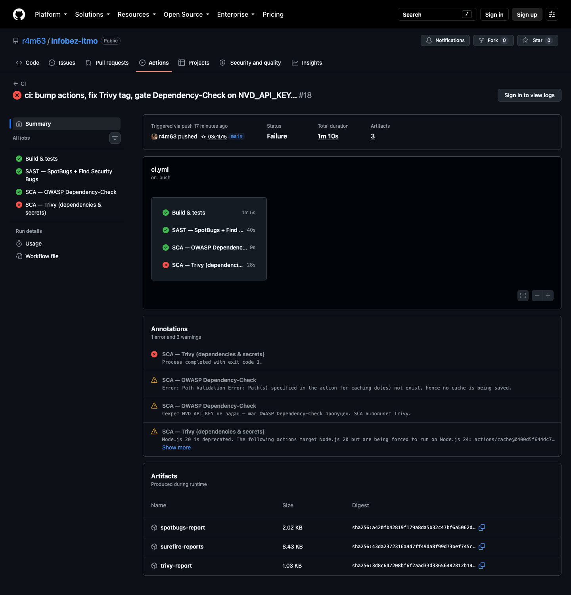

# Работа 1: защищённый REST API

Учебное приложение на Java 25 и Spring Boot 4.1.1. Вся логика API находится в
[ApiController.java](src/main/java/com/itmo/infobezitmo/ApiController.java).
Для хранения есть одна [JPA-сущность Post](src/main/java/com/itmo/infobezitmo/Post.java)
и один [репозиторий](src/main/java/com/itmo/infobezitmo/PostRepository.java).
Hibernate работает с H2 в памяти; данные сбрасываются при перезапуске.
Правила доступа и проверка JWT находятся в
[SecurityConfig.java](src/main/java/com/itmo/infobezitmo/SecurityConfig.java).

- [Публичный репозиторий](https://github.com/r4m63/infobez-itmo)
- [GitHub Actions](https://github.com/r4m63/infobez-itmo/actions/workflows/ci.yml)
- [Успешные запуски CI](https://github.com/r4m63/infobez-itmo/actions/workflows/ci.yml?query=branch%3Amain+is%3Asuccess)

## Запуск

```bash
./mvnw spring-boot:run
```

Java 25 необходима для сборки. Проверки локально: `./mvnw verify` и
`./mvnw -DskipTests compile spotbugs:spotbugs spotbugs:check`.
Учебные пользователи: `admin` / `admin-password` и `user` / `user-password`.
В `application.yaml` записаны только bcrypt-хэши паролей (cost 12).
Эти публичные учётные данные предназначены только для локальной демонстрации.

## API

| Метод | Путь | Доступ | Назначение |
|---|---|---|---|
| POST | `/auth/login` | Публичный | Логин и пароль → JWT |
| GET | `/api/data` | Bearer JWT | Список постов; `?query=` ищет по заголовку |
| POST | `/api/posts` | Bearer JWT | Создать пост; автор берётся из токена |

```bash
curl -i localhost:8080/api/data
# 401 Unauthorized без токена

curl -i -X POST localhost:8080/auth/login \
  -H 'Content-Type: application/json' \
  -d '{"username":"admin","password":"admin-password"}'
# 200 OK: {"accessToken":"...","tokenType":"Bearer","expiresIn":900}

TOKEN='<accessToken из ответа>'
curl -H "Authorization: Bearer $TOKEN" localhost:8080/api/data
curl -X POST localhost:8080/api/posts \
  -H "Authorization: Bearer $TOKEN" -H 'Content-Type: application/json' \
  -d '{"title":"Заголовок","content":"Текст"}'
```

Ответ на создание поста имеет статус 201. Неверный пароль и недействительный JWT
дают 401. [Протокол ручной проверки curl](docs/curl-session.txt).

## Защита

- **SQLi:** операции с H2 выполняются через Spring Data JPA / Hibernate.
  Поиск использует именованный параметр `:query` в JPQL, поэтому введённая
  строка не становится частью SQL-команды. Нагрузка `' OR '1'='1`
  возвращает пустой список.
- **XSS:** поля поста экранируются `HtmlUtils.htmlEscape` перед возвратом в JSON.
  Например, `<script>` становится `&lt;script&gt;`. Также включены
  `Content-Security-Policy` и `X-Content-Type-Options: nosniff`.
- **Аутентификация:** пароль проверяется по bcrypt-хэшу; при успехе выдаётся JWT,
  подписанный HS256. Случайный ключ создаётся при каждом запуске приложения;
  срок действия токена — 15 минут. После перезапуска ранее выданные токены
  становятся недействительными.
  Стандартный фильтр Spring Security проверяет подпись, срок и издателя токена.
  Только `/auth/login` открыт без токена. Автор нового поста берётся из
  проверенной учётной записи, а не из JSON запроса.
- **Валидация:** логин, пароль, заголовок и текст не могут быть пустыми; их длина
  ограничена. Ошибки возвращаются без стектрейсов. API не использует cookie и
  серверные сессии.

Для публичного развёртывания дополнительно понадобятся HTTPS, ограничение
частоты попыток входа и механизм отзыва токенов. Тесты в
[ApiSecurityTest.java](src/test/java/com/itmo/infobezitmo/ApiSecurityTest.java)
проверяют вход, 401 без токена и с подделкой, создание поста, XSS, SQLi и валидацию.

## CI и отчёты

[Workflow](.github/workflows/ci.yml) запускается при каждом `push` и
`pull_request`. Его шаги:

| Проверка | Инструмент | Результат |
|---|---|---|
| Сборка и тесты | Maven + JUnit | Ошибка job при падении теста |
| SAST | SpotBugs + Find Security Bugs | Анализ Java-байткода, XML/HTML-отчёт |
| SCA | Trivy | Поиск известных уязвимостей в зависимостях; отчёт в артефакте |
| Дополнительная SCA | OWASP Dependency-Check | HTML/JSON-отчёт при наличии `NVD_API_KEY` |

Trivy завершает job с ошибкой при находке уровня HIGH/CRITICAL.
Dependency-Check настроен в Maven, но без секрета Actions `NVD_API_KEY` его
шаг **пропускается**; зелёный статус этой job сам по себе не является результатом
сканирования. Чтобы получить отчёт именно Dependency-Check, добавьте ключ NVD
в Settings → Secrets and variables → Actions и перезапустите workflow.

Скриншоты ниже относятся к предыдущему запуску этого репозитория; после
упрощения кода актуальный результат следует смотреть по ссылке на CI выше.





Уязвимость CVE-2025-66021 в старой версии
`owasp-java-html-sanitizer` была найдена Trivy и исправлена удалением
этой зависимости. [Запуск до исправления](https://github.com/r4m63/infobez-itmo/actions/runs/35099573443).

## Контрольные вопросы

1. **Почему bcrypt, а не SHA-256?** SHA-256 слишком быстр для хранения паролей:
   украденные хэши удобно перебирать. bcrypt использует случайную соль и
   настраиваемую стоимость вычисления (здесь cost 12).
2. **Чем SAST отличается от DAST?** SAST анализирует код или байткод без запуска
   приложения. DAST посылает запросы работающему приложению и изучает ответы.
3. **Как работает JWT?** Токен состоит из `header.payload.signature`. Здесь
   payload содержит издателя `iss`, пользователя `sub`, время выпуска `iat` и
   истечения `exp`. Сервер проверяет HMAC-подпись и ограничения времени и
   издателя. Payload закодирован, но не зашифрован.
4. **Зачем аудит зависимостей?** Даже безопасный собственный код может
   использовать библиотеку с известной CVE. SCA находит такие зависимости,
   включая косвенные, чтобы их можно было обновить или заменить.
